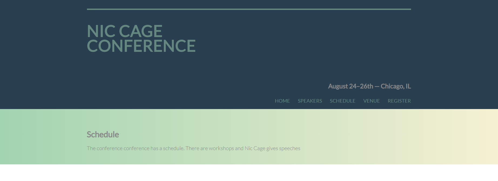
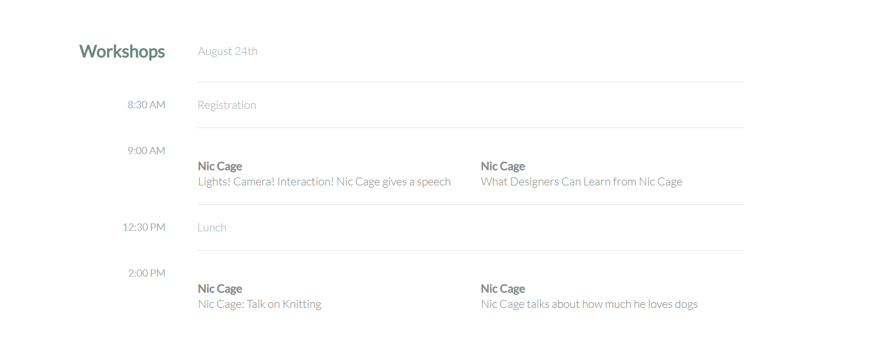

# UIB-Tables-Conference

- Create a header section
- Create a navigation with links
- All links should have hover effect
- Create at least one table like the one shown
- Use a linear gradient as a background

You can use whatever colors you want and make the conference topic on any subject.

Bonus - reuse the header/nav section and link to other pages with different tables on each page.

